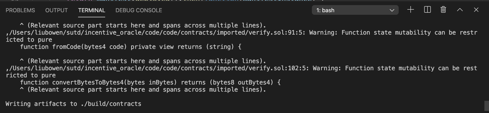
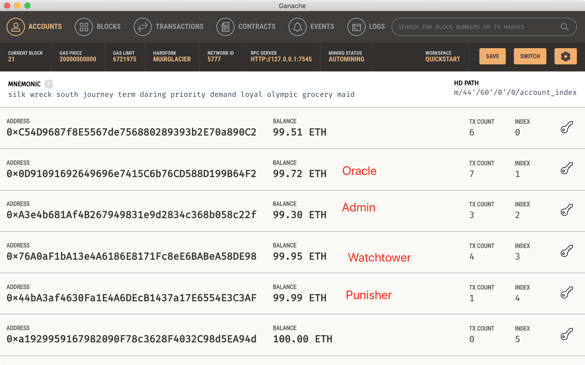
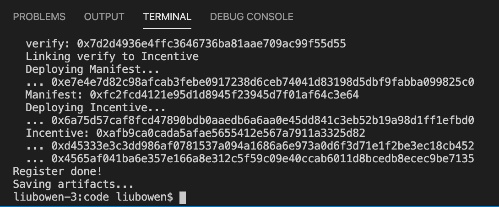
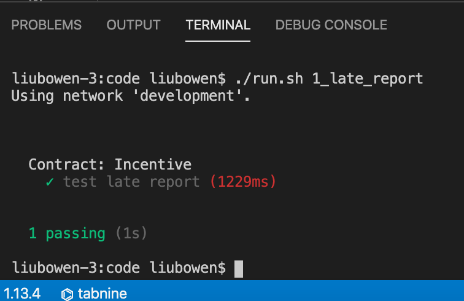

# Being Accountable Never Cheats: An Incentive for DeFi Oracles
This project is a prototype of [research paper](https://lbwtorino.github.io/incentive.pdf), which
is currently under reviewed by IEEE DAPPS'2022. 

## Project Overview
This research paper proposes an incentive protocol for DeFi oracles which motivates oracle nodes to be sufficiently accountable. To achieve it,

- `Admin` is an operator of a DeFi platform. He is supposed to deploy an *incentive contract* with punishment/dispute/resolution functionalities
- `Oracle` refers to oracle operator. He needs to make a transparent service/obligation declaration (*manifest contract*) so that its behavior can be exaimed by the public. He can also trigger dispute for any wrongful punishment by `Punisher`
- `Punisher` is an authorized actor who can submit punishment transaction once he detects oracle's misbehavior
- `Watchtower` is designed to resolve the dispute by using Ethereum's event and log mechanism


## System/Packages Requirements

The neccessary prerequisites are:

- [Ethereum Truffle testnet](https://www.trufflesuite.com/docs/truffle/getting-started/installation) framework, v4.1.15 (Nodejs: v16.1.0)
- [Solidity](https://docs.soliditylang.org/en/v0.7.4/) compiler, v0.4.25 (solc-js)
- [Ganache](https://www.trufflesuite.com/ganache)
- Misc: python, make, etc,. (to update)

## Code architecture

- `/contracts`: `Manifest contract` by oracle, and `Incentive contract` by admin
- `/migrations`: Truffle deployment file, including registration transaction from oracle/punisher/watchtower 
- `/Party`: An `Oracle`, an `Punisher`, and an `Watchtower`, implemented by .js (require `node-localstorage` package)
- `/node_modules`: Required npm package, e.g., web.js, node-localstorage, microtime, etc
- `/run`: Folder of javascript testing script, Truffle uses the Mocha testing framework and Chai for assertions
- `.run.sh`: testing script
- `truffle-config.js`: Configuration file, deployment on Truffle + Ganache testnet

## Running test cases

### Step 1 Compile smart contract
Make sure Ganache is running on your environment. Then, compile `Manifest contract` and `Incentive contract`
```sh
$ truffle compile
```


### Step 2 Deploy smart contract
Before running migrations, replace the (pk, sk) pair for oracle/admin/watchtower/punisher in `/migrations/3_incentive.js`. As shown below, we specify
Ganache's `account[1]` - `account[4]` to represent these four actors.



Then, 
```sh
$ truffle migrate
```
`/migrations/3_incentive.js` is a javaScript files that help to deploy contracts to the Ethereum network.



### Step 3 Sending transactions
To test *late report* oracle penalty,
```sh
$ ./run.sh 1_late_report
```
It executes [/run/run_1_late_report.js](https://github.com/lbwtorino/BANC-A-Being-Accountable-Never-Cheats-Incentive-for-DeFi-Oracles/blob/master/run/run_1_late_report.js) javascript test file, including the workflow of `penalty transaction` by punisher (**line 23**),
`dispute transaction` by honest oracle (**line 34**), and `resolution transaction` by watchtower (**line 47**). 

Meanwhile, watchtower uses Ethereum's event & log mechanism to notice the emitted `penalty` and `dispute` events from `Incentive contract`, and captures the required data (**line 24-29** for penalty event and **line 34-42** for dispute event). 



In addition, more test cases to punish other misbehavior of oracles can be found in `./run` folder. E.g.,

To test *high deviation* oracle penalty, run `./run.sh 2_high_deviation`

To test *wrong source* oracle penalty, run `./run.sh 3_wrong_source`

To test *wrong methodology* oracle penalty, run `./run.sh 4_wrong_methodology`

To test *slow reaction* oracle penalty, run `./run.sh 5_slow_reaction`


## Contact
lbwtorino@gmail.com
